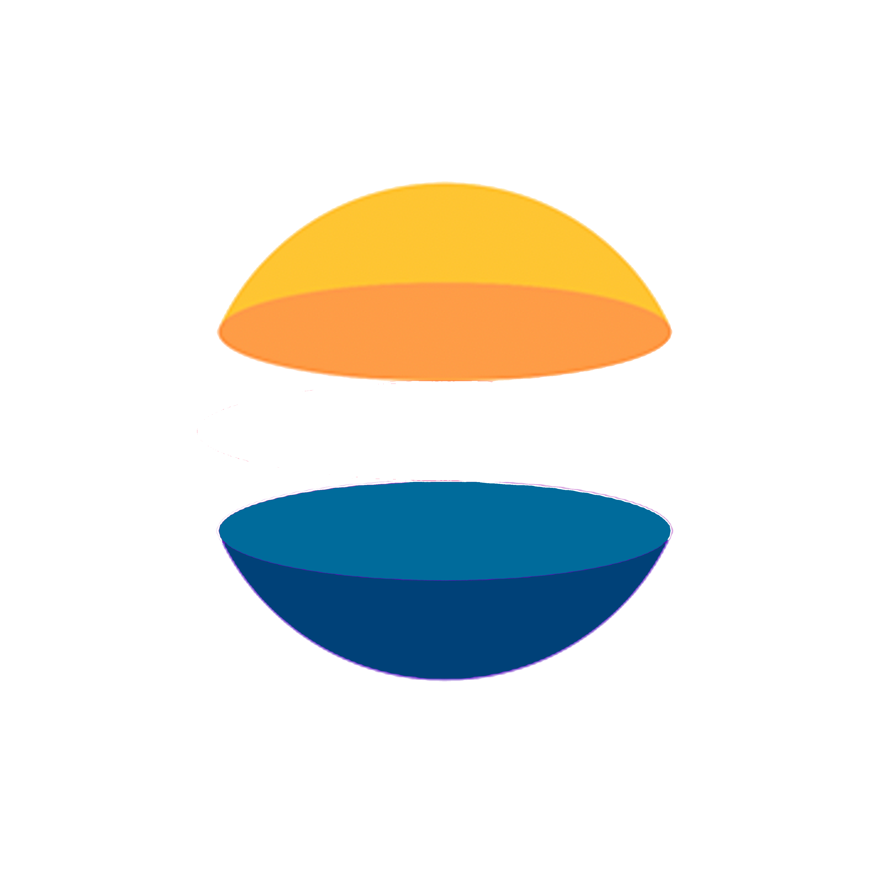
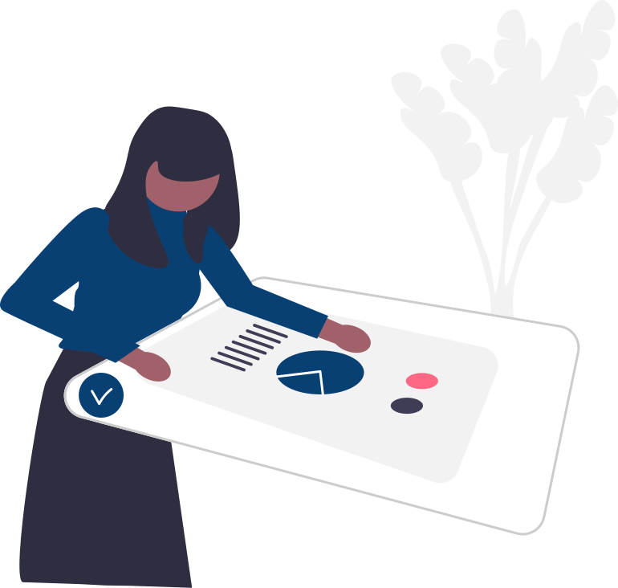

<div id="top"></div>

[![Contributors][contributors-shield]][contributors-url]
[![Forks][forks-shield]][forks-url]
[![Stargazers][stars-shield]][stars-url]
[![Issues][issues-shield]][issues-url]
[![MIT License][license-shield]][license-url]


<!-- PROJECT LOGO -->
<br />
<div align="center">
  <a href="https://github.com/les-bogoss/LaraDESK">
    
  </a>

<h3 align="center">LaraDESK</h3>

  <p align="center">
    A simple but yet complete Helpdesk app made in laravel
    <br />
    <a href="https://github.com/les-bogoss/LaraDESK"><strong>Explore the docs »</strong></a>
    <br />
    <br />
    <a href="https://github.com/les-bogoss/LaraDESK/issues/new?assignees=&labels=&template=feature_request.md&title=">Request Feature</a>
    ·
    <a href="https://github.com/les-bogoss/LaraDESK/issues/new?assignees=&labels=&template=bug_report.md&title=">Report a Bug</a>
  </p>
</div>


<!-- TABLE OF CONTENTS -->
<details>
  <summary>Table of Contents</summary>
  <ol>
    <li>
      <a href="#about-the-project">About The Project</a>
      <ul>
        <li><a href="#built-with">Built With</a></li>
      </ul>
    </li>
    <li>
      <a href="#getting-started">Getting Started</a>
      <ul>
        <li><a href="#prerequisites">Prerequisites</a></li>
        <li><a href="#installation">Installation</a></li>
      </ul>
    </li>
    <li><a href="#usage">Usage</a></li>
    <li><a href="#roadmap">Roadmap</a></li>
    <li><a href="#contributing">Contributing</a></li>
    <li><a href="#license">License</a></li>
    <li><a href="#contact">Contact</a></li>
    <li><a href="#acknowledgments">Acknowledgments</a></li>
  </ol>
</details>


<!-- ABOUT THE PROJECT -->
## About The Project

<p align="center">

</p>
<p align="right">(<a href="#top">back to top</a>)</p>


### Built With

* [Laravel](https://laravel.com)
* [Flutter](https://flutter.io)
* [Apache 2](https://www.apache.org/)
* [Docker](https://www.docker.com/)
* [Google Cloud](https://console.cloud.google.com/)
* [Git](https://git-scm.com/)


<p align="right">(<a href="#top">back to top</a>)</p>


<!-- GETTING STARTED -->
## Getting Started

To get a local copy up and running follow these simple example steps.

### Prerequisites

* mysql
* php
* composer


### Installation

1. Create a database name `laravel` and a user `root` with password `*******`
2. Clone the repo
   ```sh
   git clone https://github.com/les-bogoss/LaraDESK.git
   ```
3. Change directory to the cloned repo
   ```sh
   cd LaraDESK
   ```
4. Install dependencies
   ```sh
   composer install
   ```
5. Run migration and seeding
    ```sh
    php artisan migrate:fresh --seed
    ```
5. Run the server
    ```sh
    php artisan serve
    ```

<p align="right">(<a href="#top">back to top</a>)</p>


<!-- USAGE EXAMPLES -->
## Usage

_For more examples, please refer to the [Documentation](https://github.com/les-bogoss/LaraDESK)_

<p align="right">(<a href="#top">back to top</a>)</p>


<!-- ROADMAP -->
## Roadmap
<!-- - [ ] Feature 3
    - [ ] Nested Feature -->

See the [open issues](https://github.com/les-bogoss/LaraDESK/issues) for a full list of proposed features or open one.

<p align="right">(<a href="#top">back to top</a>)</p>


<!-- CONTACT -->
## Contact

* Célian HAMON    - hamoncelian@gmail.com
* Théo TRUVELOT - theotruvelott@gmail.com 
* Alan COURTOIS  - alancrts27@gmail.com
* Evan OSMONT     - evan.osmont@gmail.com

Project Link: [https://github.com/les-bogoss/LaraDESK](https://github.com/les-bogoss/LaraDESK)

<p align="right">(<a href="#top">back to top</a>)</p>


<!-- ACKNOWLEDGMENTS -->
## Acknowledgments

* [Aléxis PETIT](https://www.linkedin.com/in/alexispe/)
* [Maxence MACHU](https://www.linkedin.com/in/maxence-machu/)
* [Benoît BÉRENGER](https://www.linkedin.com/in/benoitberenger/)

<p align="right">(<a href="#top">back to top</a>)</p>


<!-- MARKDOWN LINKS & IMAGES -->
[contributors-shield]: https://img.shields.io/github/contributors/les-bogoss/LaraDESK.svg?style=for-the-badge
[contributors-url]: https://github.com/les-bogoss/LaraDESK/graphs/contributors
[forks-shield]: https://img.shields.io/github/forks/les-bogoss/LaraDESK.svg?style=for-the-badge
[forks-url]: https://github.com/les-bogoss/LaraDESK/network/members
[stars-shield]: https://img.shields.io/github/stars/les-bogoss/LaraDESK.svg?style=for-the-badge
[stars-url]: https://github.com/les-bogoss/LaraDESK/stargazers
[issues-shield]: https://img.shields.io/github/issues/les-bogoss/LaraDESK.svg?style=for-the-badge
[issues-url]: https://github.com/les-bogoss/LaraDESK/issues
[license-shield]: https://img.shields.io/github/license/les-bogoss/LaraDESK.svg?style=for-the-badge
[license-url]: https://github.com/les-bogoss/LaraDESK/blob/master/LICENSE.txt
[product-screenshot]: dessin.svg
